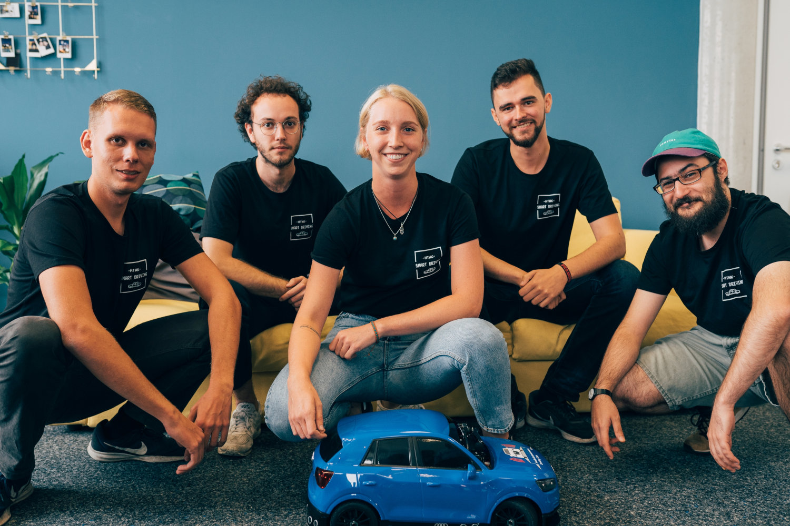

Diese Woche ging es für das Team und die Betreuerin des Teams Prof. Schwarz zum Kick-Off nach Ingolstadt. Neben allgemeinen Informationen und der Vorstellung der diesjährigen Fahraufgaben, bekamen wir eine Führung durch die eindrucksvolle und hoch-automatisierte Fabrik.

Insgesamt kamen 16 Teams aus ganz Europa am Dienstag und Mittwoch in Ingolstadt zusammen. Mit den 6 selbstfinanzierten Teams wird es im Vergleich zum letzten Jahr (13 Teams) herausfordernder das Qualifying zu bestehen und als eines der 8 Teams ins Finale einzuziehen.

Das Kick-Off endete mit der feierlichen Übergabe der beiden Modellfahrzeuge, die wir dann mit nach Leipzig nehmen durfte. Bis zum 10. Oktober haben wir nun Zeit an den neu gestellten Fahraufgaben zu entwickeln und die Entwicklungen aus dem letzten Jahr zu optimieren.

