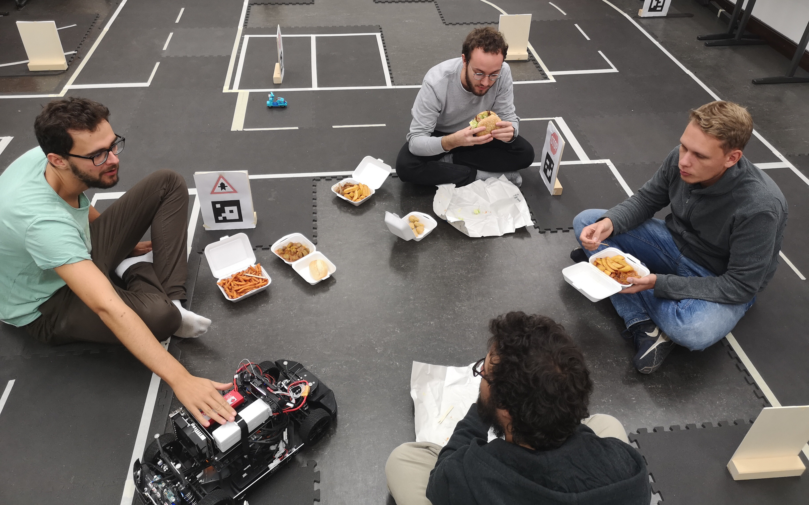
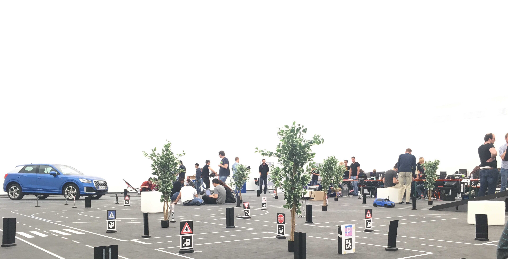

Nach 3 Monaten harter Arbeit ist der Audi Autonomous Driving Cup 2018 nach dem Testevent für unser Team schon wieder vorbei. Es folgt eine kleine Zusammenfassung unserer Erfahrungen beim diesjährigen AADC.

Nachdem wir im Juni mit den Autos aus Ingolstadt zurückkamen, war das gesamte Team voller Tatendrang. Aufgrund eines fehlenden Raums zum Aufbau einer geeigneten Teststrecke konnten wir leider nicht direkt mit der Entwicklung an den Autos starten. Es begangen also erst einmal die wöchentlichen Treffen, um unser Vorhaben zu besprechen. Wir wälzten Paper und erstellten eine Roadmap für die kommenden Monate. Nach Beendigung der Prüfungsphase im Juli ging es dann los mit der Entwicklungsphase in einem Seminarraum der HTWK. Anfängliche Startschwierigkeiten ließen wir so schnell es ging hinter uns und konzentrierten uns darauf Teile des Codes aus dem letzten Jahr zu portieren. Neu dazu kam die Verarbeitung von den von Audi gelieferten [OpenDRIVE](http://www.opendrive.org/docs/OpenDRIVEFormatSpecRev1.4H.pdf) Kartendaten. Auf Basis dieser Daten implementierten wir eine neue Trajektorien-Berechnung.

Da das Auto in diesem Jahr von Audi mit einem Laserscanner ausgestattet wurde, begannen wir außerdem essentielle Bestandteile wie den Notstopp und die Hinderniserkennung umzuschreiben, um die Laserscanner-Daten optimal mit den Daten der Ultraschaller und der Kamera zu fusionieren. Des Weiteren konzentrierten wir uns auf die neue Fahraufgabe: die Notfallfahrzeugerkennung. Über das Mikrofon am Auto sollte die Sirene des Notfallfahrzeugs mithilfe von Machine Learning erkannt werden.

Die letzten zwei Wochen vor dem Testevent verbrachten wir Tag und Nacht mit Programmieren und Testen in unserem Labor. Gegessen wurde in kurzen Pausen auf unserer ganz eigenen Raststätte.

Am 8. Oktober ging es dann zum Testevent nach Ingolstadt. Dort konnten wir auf Audis Teststrecke den gesamten 9. und 10. Oktober alles testen und weiterentwickeln. Das Fahren klappte an den Testtagen einwandfrei. Selbst die Rampe, das in diesem Jahr neu dazugekommene Straßenelement, welches eine Autobahnauffahrt simulieren soll, fuhr das Auto perfekt, ohne es zuvor einmal getestet zu haben.

Am Morgen des 11. Oktober startete dann das Qualifying… und unser Auto fuhr nicht los.

Was also war das Problem?

Wie schon im letzten Jahr beim Finale bewiesen wir dieses Jahr im Testevent Mut zur Lücke. Noch während der Testtage in Ingolstadt versuchten wir verschiedene Komponenten unserer Architektur, die unabhängig voneinander entwickelt wurden zusammenzubringen. Schlussendlich scheiterten wir daran das Ein- und Ausparken und das eigentliche Fahren in der kurzen Zeit, die uns noch blieb, zu vereinen. Gut, parken wir eben nicht, wenn die Jury das von uns verlangt, mit ein paar Strafpunkten können wir leben, dachten wir uns einen Tag vor dem Qualifying. Leider begann die Strecke des Qualifying aber in einer Parklücke und das Ausparken war die erste Fahraufgabe. Die Parklücke verließen wir somit nicht.

Trotz der Niederlage war auch der diesjährige AADC eine große Bereicherung für das gesamte Team. Durch Oberseminare, Masterprojekte und Masterarbeiten geht es jetzt teilweise mit der Entwicklung weiter in der Hoffnung, dass sich auch im nächsten Jahr ein Team findet, das diese Vorarbeiten für den AADC 2019 nutzen kann.

Wir alle starten mit einem Schatz an Erfahrungen und neuem Wissen in das Wintersemester und sind auch etwas erleichtert neben Vorlesungen und Seminaren wieder ein bisschen Freizeit und Schlaf zu haben.
