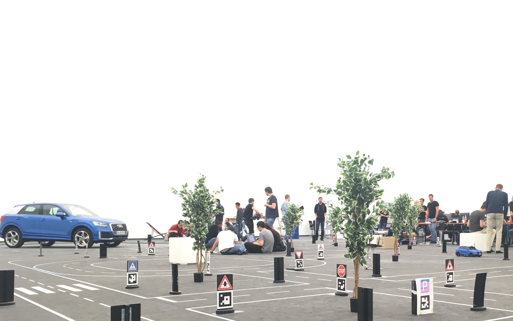

Nach 3 Monaten harter Arbeit ist der Audi Autonomous Driving Cup 2018 für unser Team schon wieder vorbei. Leider hat es in diesem Jahr nicht für die Qualifizierung für das Finale im November gereicht. Es folgt eine kleine Zusammenfassung unserer Erfahrungen beim diesjährigen AADC.

Nachdem wir im Juni mit den Autos aus Ingolstadt zurückkamen, war das gesamte Team voller Tatendrang. Es begangen die wöchentlichen Treffen, um unser Vorhaben zu besprechen. Wir wälzten Paper und erstellten eine Roadmap für die kommenden Monate. Nach Beendigung der Prüfungsphase im Juli ging es dann los mit der Entwicklungsphase. Anfängliche Startschwierigkeiten ließen wir so schnell es ging hinter uns und konzentrierten uns darauf Teile des Codes aus dem letzten Jahr zu portieren. Neu dazu kamen die Verarbeitung von den von Audi gelieferten [OpenDRIVE](https://en.wikipedia.org/wiki/OpenDRIVE_(specification) Kartendaten und eine neue Trajektorien-Berechnung auf Basis dieser Daten.

Da das Auto in diesem Jahr von Audi mit einem Laserscanner ausgestattet wurde, begannen wir außerdem essentielle Bestandteile wie den Notstopp und die Hinderniserkennung umzuschreiben, um die Laserscanner-Daten optimal mit den Daten der Ultraschaller und der Kamera zu fusionieren. Des Weiteren konzentrierten wir uns auf die neue Fahraufgabe: die Notfallfahrzeugerkennung. Über das Mikrofon am Auto sollte die Sirene des Notfallfahrzeugs mithilfe von Machine Learning erkannt werden.

Die letzten zwei Wochen vor dem Testevent verbrachten wir Tag und Nacht mit Programmieren und Testen in unserem Labor. Gegessen wurde in kurzen Pausen auf unserer ganz eigenen Raststätte.

Am 8. Oktober ging es dann zum Testevent nach Ingolstadt. Dort konnten wir auf Audis Teststrecke den gesamten 9. und 10. Oktober alles testen und weiterentwickeln.

Am Morgen des 11. Oktober startete dann das Qualifying… und wir fuhren nicht los. Noch beim Testen klappte alles einwandfrei. Einen Tag vorher hatten wir zum einzigen und ersten Mal die Rampe, das in diesem Jahr neu dazugekommene Straßenelement, welches eine Autobahnauffahrt simulieren soll, getestet und selbst diese fuhren wir einwandfrei hoch und runter.

Was also war das Problem?

Wie schon im letzten Jahr beim Finale bewiesen wir dieses Jahr im Testevent Mut zur Lücke. Noch während der Testtage in Ingolstadt versuchten wir verschiedene Komponenten unserer Architektur, die unabhängig voneinander entwickelt wurden zusammenzubringen. Schlussendlich scheiterten wir daran den Park-Algorithmus und das eigentlich Fahren in der kurzen Zeit, die uns noch blieb, zu vereinen. Gut, parken wir eben nicht, wenn die Jury das von uns verlangt, mit ein paar Strafpunkten können wir leben, dachten wir uns einen Tag vor dem Qualifying. Leider begann die Strecke des Qualifying aber in einer Parklücke und das Ausparken war Teil des Park-Algorithmus. Somit verließen wir diese Parklücke selbstverständlich nicht.

Trotz der Niederlage war auch der diesjährige AADC eine große Bereicherung für das gesamte Team. Durch Oberseminare, Masterprojekte und Masterarbeiten geht es jetzt teilweise mit der Entwicklung weiter in der Hoffnung, dass sich auch im nächsten Jahr ein Team findet, das diese Vorarbeiten für den AADC 2019 nutzen kann.

Wir alle starten mit einem Schatz an Erfahrungen und neuem Wissen in das Wintersemester und sind auch ein bisschen froh neben Vorlesungen und Seminaren wieder ein bisschen Freizeit und Schlaf genießen zu können.
