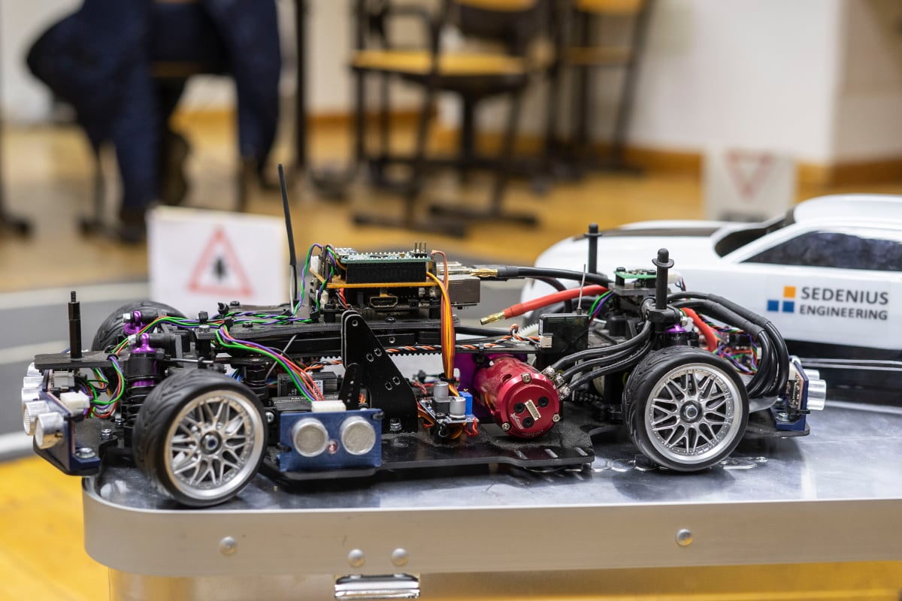
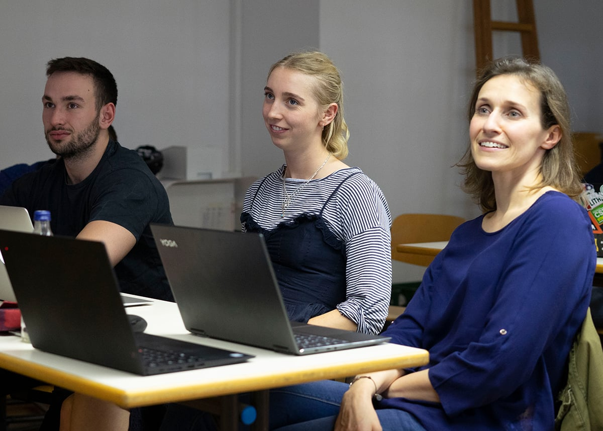
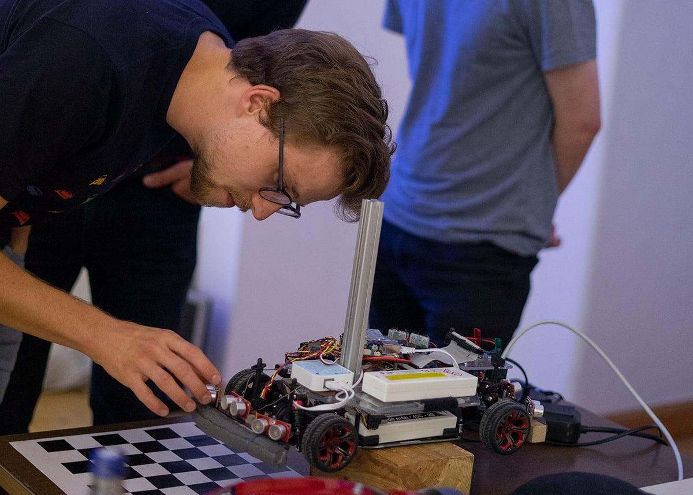
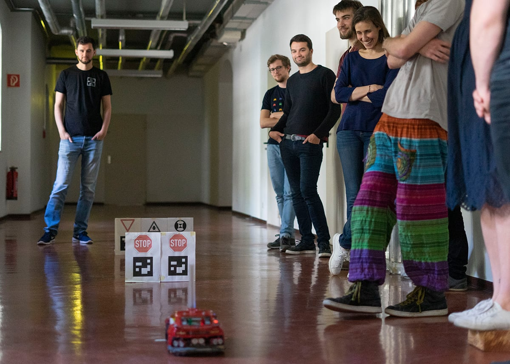
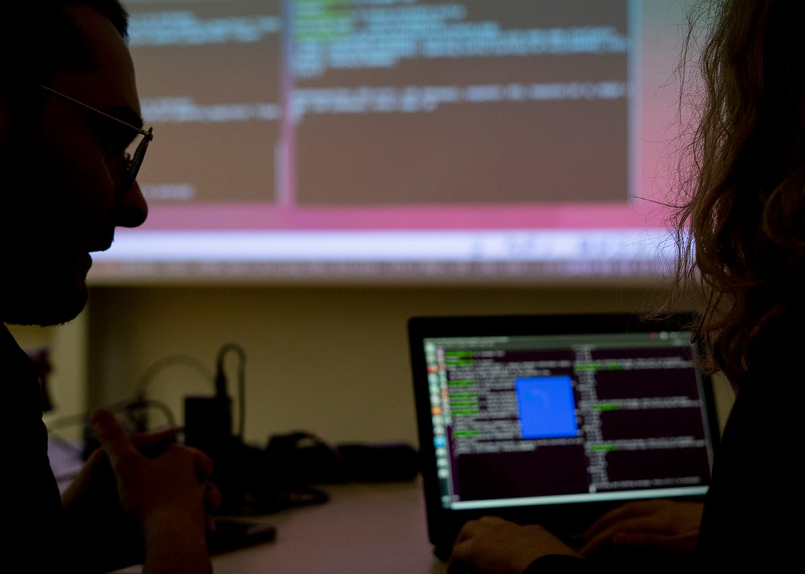

Wie auch schon die letzen Jahre, war unser Team auch dieses Jahr auf der [Langen Nacht der Computerspiele](https://computerspielenacht.htwk-leipzig.de/computerspielenacht/) vertreten. An unserem kleinen Stand präsentierten wir alles rund ums Team und boten jedem interessierten Besucher die Möglichkeit selbst Mal ein autonomes Fahrzeug zu steuern. Auch hatten wir zum ersten mal die Möglichkeit das neueste Fahrzeug, welches uns von Sedenius Engineering zur Verfügung gestellt wurde, dem Publikum vorzustellen.

Der neue weiße Flitzer wird bald von unserem Team auf der Basis von ROS programmiert werden. ROS ist ein Framework, welches als Grundlage vieler Roboterprojekte verwendet wird.
Abgerundet wurde unsere Teilnahme an der LNdC durch einen Vortrag, welcher von Lina Peters und Leo Binder gegen 22Uhr dem gespannten Publikum im Hörsaal präsentiert wurde. Dabei gingen die beiden auf die aktuelle Arbeit im Team und die Teilnahme am AADC der letzten Jahre ein und vergaßen natürlich nicht Werbung für den 1. Workshop des Teams zu machen.

Am 18.5. fand, wie schon Wochen zuvor angekündigt, der 1. Workshop des Smart Driving Teams statt, zu welchem Studierende der Fakultät Informatik und Medien eingeladen waren. Motiviert war der Workshop aus der Idee heraus das Team größer aufzustellen und mehr Studierenden zugänglich zu machen. Es war geplant die Veranstaltung zu nutzen um den Interessenten zu zeigen woran wir konkret arbeiten und was eine Teilnahme am HTWK Smart Driving Team für Möglichkeiten bietet.

Begonnen wurde der Workshop mit einer Vorstellung der Firma Optimax Energy GmbH, welche eine weiterer Unterstützer unserer Teams ist und an diesem Tag für das leibliche Wohl der Teilnehmer sorgte. Als nächstes wurde den Informatikerinnen und Informatikern das Team und die Arbeit der letzten Jahre vorgestellt und näher auf die im AADC verwendeten Technologien eingegangen. Immer wieder gab es regen Austausch zu verschiedenen Themen und Ideen oder wurden die von früheren Teammitgliedern gebauten Fahrzeuge bewundert. In den vergangen Jahren wurden Fahrzeuge auch selbst gebaut ums damit am [Carolo-Cup](https://wiki.ifr.ing.tu-bs.de/carolocup/) teilzunehmen, was leider nie geschah. Aktuell dienen uns die Fahrzeuge um Ideen des autonomen Fahrens zu realisieren und zu testen. Auch der [Carolo-Cup](https://wiki.ifr.ing.tu-bs.de/carolocup/) selbst wurde durch István Derda vorgestellt und gemeinsam mit den Anwesenden eine Teilnahme im nächsten Jahr diskutiert.

Als kleine Motivation wurde der neu in ROS implementierte Notstopp an unserm roten Flitzer demonstriert, um im Folgenden ein ROS-Toutorial gemeinsam mit den Anwesenden zu absolvieren. Die Teilnehmer konnten mithilfe einer von uns bereitgestellten Virtuellen Maschine ohne große Installation ROS ausprobieren und damit programmieren. Als kleine Belohnung nach dem Tutorial gab es für alle Pizza und Mate. Weiters Thema auf dem Workshop waren die ethischen Fragen, die sich in Zusammenhang mit dem autonomen Fahren ergeben. Auch dieser Vortrag führte zu einer angeregten Diskussion unter den Teilnehmenden.

Alles in allem waren wir sehr begeistert von dem großen Interesse und der Motivation der Teilnehmenden und sind glücklich darüber, wie viel alle von der Veranstaltung mitnehmen konnten. Kurz nach dem Workshop ist jetzt schon klar, dass es ein paar neue Gesichter in unserm Team geben wird. Wir freuen uns schon jetzt auf das nächste Mal.
