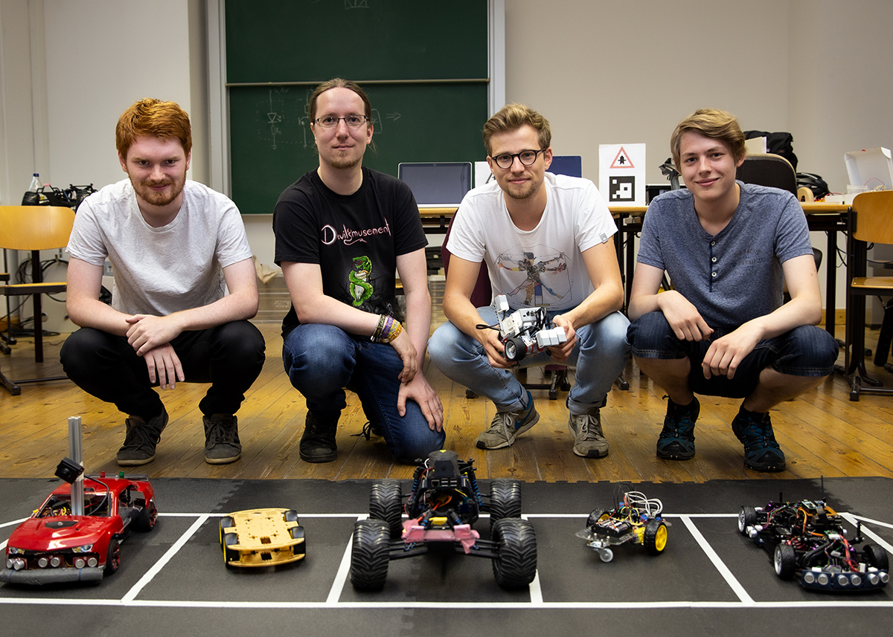

Erfolgreich hat sich unser Team beim [Autotrac2020](https://ec.europa.eu/jrc/en/event/other-event/jrc-autotrac-2020-how-future-road-transport-will-look) beworben. Als eines von 12 Teams können unsere Smart Driver Thomas Grund, Jonas Höfer, Malte Hölscher und Jakob Nestler an dem Wettbewerb des Joint Research Center, welches unter der Schirmherrschaft der EU-Kommission steht, teilnehmen. Die Challenge, welche sich an Studenten, Personen aus der Wirtschaft, aber ebenso an private Maker richtet, zielt auf das effektive und effiziente Nutzen des Verkehrsnetzes durch Car-to-Car-Kommunikation ab.

So müssen die Teilnehmer vier kleine Fahrzeuge entwerfen und entwickeln, welche gemeinsam verschiedene Aufgaben in unterschiedlichen Straßenszenarien meistern sollen. Hierbei wird vor allem darauf Wert gelegt, wie die Fahrzeuge miteinander kommunizieren und gemeinsam interagieren um möglichst effizient und vorausschauend den jeweiligen Parcours abzufahren. Neben den Schwierigkeiten der eventuell unter den Fahrzeugen im Verkehr stattfindenden Interferenz gibt es auch Einparkaufgaben sowie das Erkennen fremder, fahrender Gegenstände mit entsprechend korrektem Verhalten im Straßenverkehr.

Der nächste Schritt besteht darin, bis Mitte Januar die Jury mit zwei Videos spezieller Fahraufgaben von unseren Fahrzeugen zu überzeugen. Dieser mehr symbolische Schritt sollte uns dann für die Challenge Ende Februar in Ispra (Italien) qualifizieren. Als Hauptpreis winkt dort, neben Sachpreisen, dann die Teilnahme an der [TRA2020](https://traconference.eu) in Helsinki, wo die Konzepte vorgestellt werden dürfen.
