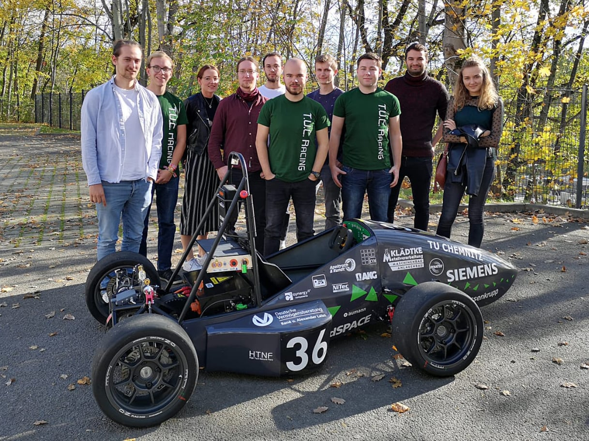

Am 26.10.19 hat sich das Smart Driving Team auf den Weg nach Chemnitz gemacht, um dort das [T.U.C. Racing Team](https://tuc-racing.de) kennen zu lernen. Das T.U.C. Racing Team ist eine Gruppe von Studierenden der TU Chemnitz, welche mit einem selbstentwickelten Rennwagen am Formular Student Germany teilnehmen.

Vor Ort gab es für uns eine kleine Einführung über die Erfolge und Vorhaben der Ingenieure. Wie die Jahre zuvor, wollen sie 2020 wieder am FSG teilnehmen, diesmal ihr Auto jedoch auch ohne Fahrer an den Start bringen, in einer neuen Kategorie namens Driverless.
Um diesen Plan zu verwirklichen wird das Smart Driving Team die Kollegen aus Chemnitz, mit dem erlangten Know-How der letzten Jahre, im Bereich des autonomen Fahrens unterstützen.

Nach den Besprechungen gab es noch ein gemeinsames Mittagessen im Herzen von Chemnitz, um sich besser kennen zu lernen. Wir freuen uns schon sehr auf die Zusammenarbeit und die tollen gemeinsamen Erfahrungen mit dem Team aus Chemnitz.
