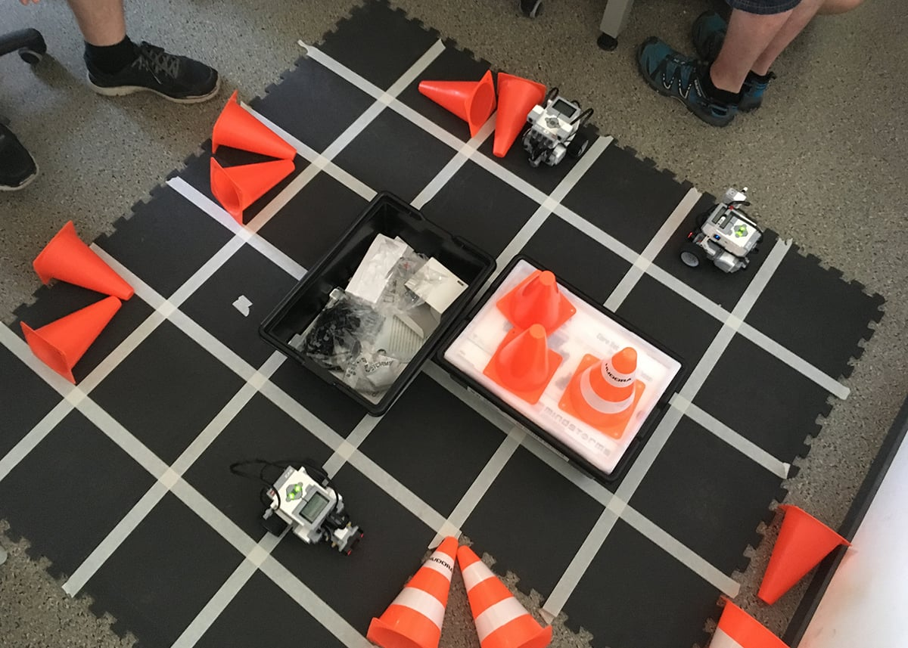
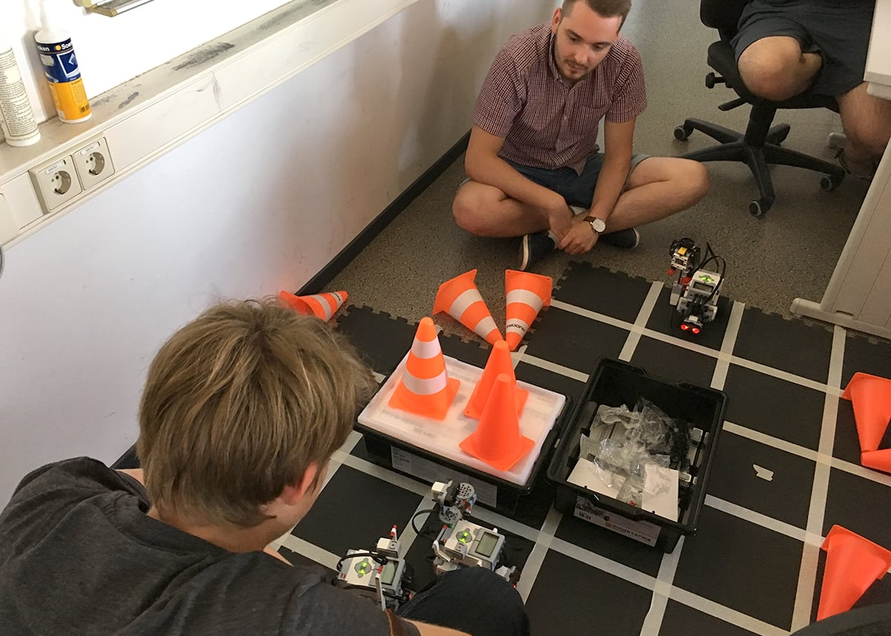
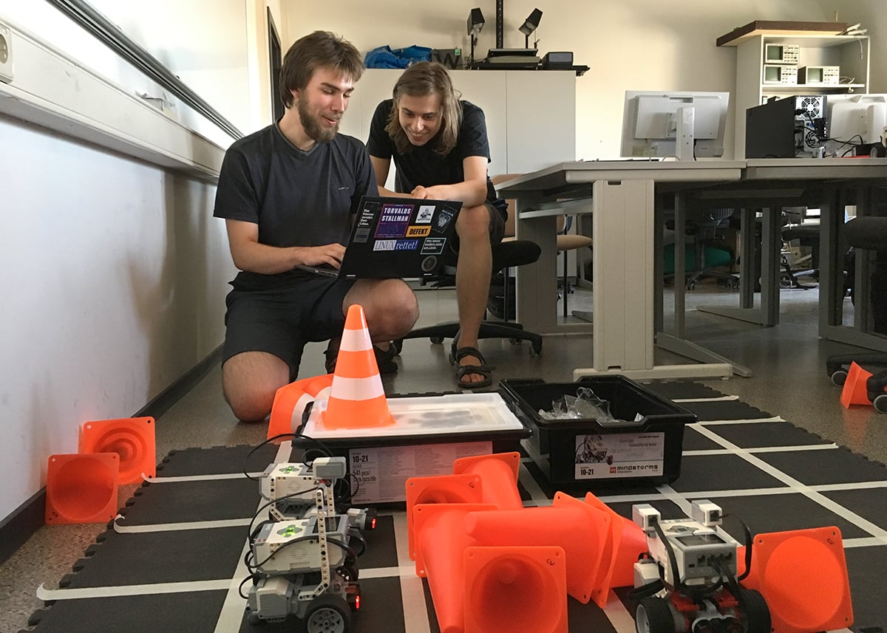

Unser Team bemüht sich, an vielen Veranstaltungen und Wettbewerben teilzunehmen um Hard-, Software und das erworbene Know-How testen und anwenden zu können. Wir freuen uns sehr, dass fast das gesamte Team, welches momentan aus rund 13 Personen besteht, Anfang August am [Saxony5 - Hackathon der HTW Dresden](https://www.htw-dresden.de/forschung/innovative-hochschule-saxony5/tv4-ccl-vernetzte-mobilitaet.html) teilnehmen kann. Dies ergänzt und bereichert unsere Vorbereitung auf Wettbewerbe wunderbar und fördert die konzentrierte Zusammenarbeit im Team.

Drei unserer Teammitglieder haben letze Woche am freiwilligen Praktikum (LegoProl) zum Modul ["Grundlagen der Künstlichen Intelligenz"](https://www.imn.htwk-leipzig.de/~schwarz/lehre/ss19/kib/) teilgenommen, welches von [Frau Professor Sibylle Schwarz](https://www.imn.htwk-leipzig.de/~schwarz/) und [Herrn Mario Wenzel](https://dbs.informatik.uni-halle.de/wenzel/) organisiert, vorbereitet und durchgeführt wurde. Aufgabe war es, LEGO MINDSTORMS EV3 Robotern mithilfe der logischen Programmiersprache Prolog beizubringen, selbständig ein Labyrinth zu kartieren und auf Basis derer den schnellsten Weg zu einem vorgegebenen Ziel zu finden. Der 4qm große Parcours bestand aus 32 kleineren Feldern von denen einige durch umgekippte Pylonen versperrt waren. Die Pylonen stellten die Hindernisse dar, welche von den Ultraschallsensoren auf den Robotern erkannt und umfahren werden mussten.

Die Roboter enthielten bereits einen Prolog-Interpreter und eine Bibliothek mit Prädikaten zur Steuerung von Motoren und Sensoren. Daher konnten sich die Teilnehmer auf Entwurf und Umsetzung ihrer Algorithmen zur Wegfindung in Prolog konzentrieren. So entschieden sich Jonas Höfer und Karl Jahnel für einen klassischen A\*-Algorithmus mit Manhattan-Distanz als Heuristik, um das Labyrinth zu durchqueren. Sehr erfolgreich manövrierte Christoph Siegert, auch aus unserem Smart Driving Team, mit seinem Kommilitonen seinen Roboter mithilfe eines Breitensuche-Algorithmus über das Feld.

Am Ende waren die 10 Studierenden, welche an der Veranstaltung teilgenommen hatten, sehr begeistert über die Möglichkeiten ihr Wissen dabei anwenden zu können. So meinte Jonas Höfer: "Meiner Meinung nach war LegoProl ein sehr interessantes Projekt, weil man logische Programmierung an einem realen Problem ausprobieren konnte. Dabei musste man sich sehr mit den Unterschieden Prologs zur klassischen imperativen Programmierung auseinandersetzen und konnte so Vorteile der Sprache besser verstehen und nutzen."
