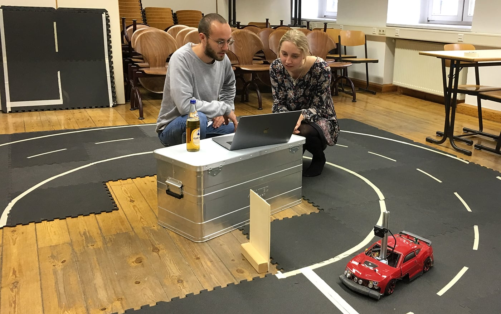

Seit seiner Gründung vor sechs Jahren bestand das HTWK Smart Driving Team meist aus nur wenigen Studierenden und widmete sich vordergründig der Teilname an dem von Audi veranstalteten [AADC](https://www.audi-autonomous-driving-cup.com).
Das führte meist dazu, dass das Team aus etwa fünf jährlich wechselnden Mitgliedern
bestand und vorwiegend halbjährig während der Zeit der Vorbereitung auf den AADC
aktiv war.

Nun ist es an der Zeit dies zu ändern und das Team breiter aufzustellen. Mit dem immer spürbareren Einzug von autonomen Fahrzeugen in unseren Alltag wächst auch das Interesse an dieser Thematik erheblich. Auch der Einsatz von KI sowie rechtliche und ethische Fragen zum autonomen Fahren wecken die Neugier auf dieses zukunftsträchtige Thema.

Derzeit können wir einen Raum an der HTWK nutzen und haben damit eine Heimat zum Arbeiten an den Modellfahrzeugen und zum Trainieren auf einem Parcours. So ist es nun möglich ein Team aufzubauen, welches ganzjährig zum Themengebiet Autonomes Fahren forscht und gut vorbereitet am AADC und evtl. auch an anderen Wettkämpfen wie zum Beispiel dem [Carolo-Cup](https://wiki.ifr.ing.tu-bs.de/carolocup/) teilnehmen kann.

Durch die Unterstützung von [Frau Prof. Schwarz](http://www.imn.htwk-leipzig.de/~schwarz/) werden die verschiedenen Themen auch in die Lehre eingebunden oder können umgekehrt mit zur Verfügung stehender Hardware praktisch angewendet werden – etwa in Digitaler Bildverarbeitung, in Oberseminaren und studentischen Projekt- und Qualifizierungsarbeiten. Auch im Softwareprojekt, welches von Studierenden im 3. und 4. Bachelor-Semester und im 1. Und 2. Master-Semester der Informatik und Medieninformatik absolviert werden muss, werden Aufgaben zur Unterstützung des Teams bearbeitet.

Das Team bietet dir die Möglichkeit mit anderen motivierten Studierenden in Kontakt zu kommen und kleine Komponenten bis hin zu ganzen Architekturen für autonome Fahrzeuge zu entwickeln. Du kannst dir neue Programmiersprachen aneignen, deine Kenntnisse in verschiednen Gebieten vertiefen, von Anderen lernen und dein Wissen weitergeben.

Wenn auch du dich für autonomes Fahren, künstliche Intelligenz und/oder die damit verbundenen Fragen zu Ethik und der zukünftigen Mobilität interessierst, melde dich und werde Teil des HTWK Smart Driving Teams.

Gerne kannst du mir eine Mail schicken an:
leo.binder@stud.htwk-leipzig.de

Auch auf der [Langen Nacht der Computerspiele](https://computerspielenacht.htwk-leipzig.de/computerspielenacht/) am 11. Mai werden wir mit einem Stand und einem Vortrag vertreten sein. Vielleicht sehen wir uns ja dort.
