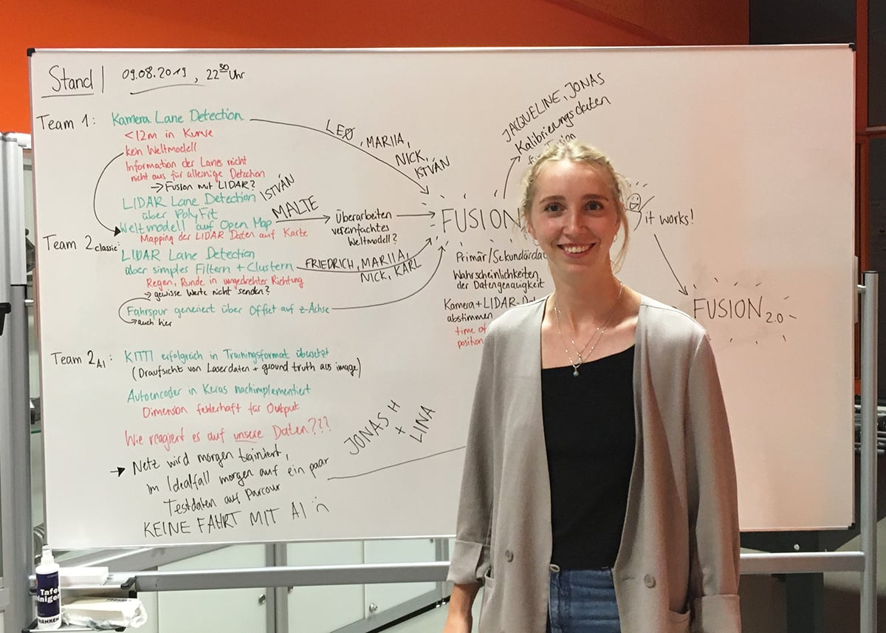

Sehr stolz möchten wir unserer ehemaligen Teamleiterin [Lina Peters](https://leenahere.github.io) zum 2. Platz des [9. Saxonia Woman Award](https://www.sogehtsoftware.de/unternehmen/initiative/saxonia-woman-award/) gratulieren. Die Auszeichung, mit der Mädchen und Frauen ermutigt werden sollen, sich für eine Ausbildung und  Karriere in der Informatik-Branche zu entscheiden, wird vom IT-Unternehmen Saxonia Systems AG verliehen.

Lina ist seit 2017 Mitglied des HTWK Smart Driving Teams und übernahm 2018 die Rolle der Teamleitung. Seit der Abgabe dieser Aufgabe steht sie dem Team noch immer mit Rat und Tat zur Seite und ist vor allem für neue Teammitglieder eine wunderbare Mentorin.

> "Menschen wie Lina sind für die Informatik und ihre Kollegen und Kommilitonen ein Geschenk, da sie es versteht ihre eigene Leidenschaft für ein Thema auf ihr Umfeld zu  projizieren und damit jedem zeigt das die digitale Welt nicht nur aus unpersönlichen 1 und 0 besteht."
 [Fabian Freihube](https://freihube.dev)

> "Lina ist eine engagierte Studentin und ein wichtiges Mitglied des HTWK Smart Driving Teams! Da wir zusammen am Hackathon Saxony5 teilgenommen haben, hatte ich die Möglichkeit Linas Begeisterung für Autonomes Fahren und KI zu beobachten und viel mitzunehmen. Es wäre super, mehr solche Mädels wie Lina in der Informatik zu haben."
 Mariia Fortova

> "Linas großes Wissen im Bereich der künstlichen Intelligenz und dem autonomen Fahren machen sie zu einem wertvollen Mitglied des Smart Driving Teams und für mich zu einer großartigen Gesprächspartnerin."
 Jonas Höfer
