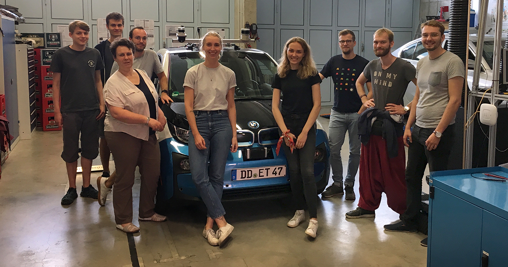
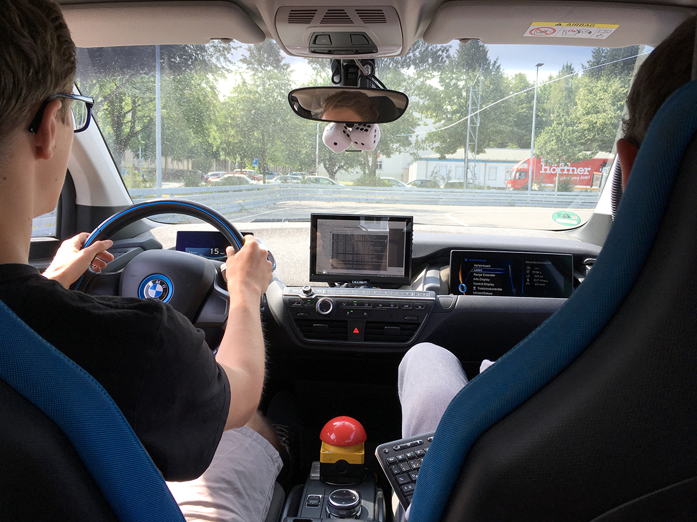
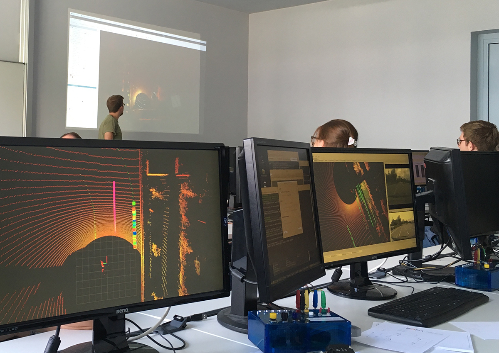

Am Montag den 5. August machte sich ein großer Teil unseres Smart-Driving-Teams, genauer acht Studierende und [Frau Professor Sibylle Schwarz](https://www.imn.htwk-leipzig.de/~schwarz/) auf nach Dresden um dort am Hackathon unterstützt vom Saxony5 teilzunehmen. Der Hackathon drehte sich eine Woche rund um das Thema autonomes Fahren. Veranstaltet wurde das Ganze in den Räumlichkeiten der Forschungseinrichtung der HTW-Dresen [Mechlab](https://www.htw-mechlab.de).

Das sehr gut ausgestattete Mechlab verfügt unter anderem über einen BMW i3, welcher mit der für autonomes Fahren benötigten Sensorik ausgestattet ist. Daneben standen uns eine Teststrecke, sowie mehrere mit der Hard- und Software gut vertraute Mitarbeiter zur Seite. Aufgabe war es das Fahrzeug so zu programmieren, dass es in der Lage war über die Information aus dem Lidar die Straße des Testparcours entlang zu fahren.

Zum Einsatz kam, wie auch bei uns im Team üblich, das Framework Robot Operating System (ROS). Dies ermöglichte uns einen schnellen Einstieg und so konnten wir innerhalb der wenigen Tag mit Hilfe der anderen Teilnehmer bemerkenswerte Ergebnisse erzielen. Verschiedene Ansätze, von trivialer Spurerkennung mit Funktionsannäherung, der Verwendung eines Weltmodells bis hin zur Anwendung von künstlichen neuronal Netzen, zeigten unterschiedlich erfolgreiche Ergebnisse. Neben dem Hackathon selbst besuchten wir auch Unternehmen wie etwa [TraceTronic GmbH](https://www.tracetronic.de), wo wir einiges über die Arbeit von Softwarezulieferern der Autoindustrie lernen konnten.

Am letzen Tag stellten wir unsere Konzepte vor und testeten die geschriebene Software auf dem autonomen Fahrzeug. Noch mehr Bilder und Berichte finden Sie auf der Seite des HTW Mechlabs: 
+ [1. Tag](http://www.htw-mechlab.de/index.php/saxony5-hackathon-tag1/)
+ [2. Tag](http://www.htw-mechlab.de/index.php/saxony5-hackathon-tag-2/)
+ [3. Tag](http://www.htw-mechlab.de/index.php/saxony5-hackathon-tag-3/)
+ [4. Tag](http://www.htw-mechlab.de/index.php/saxony5-hackathon-tag-4/)
+ [5. Tag](http://www.htw-mechlab.de/index.php/saxony5-hackathon-tag-5/)
